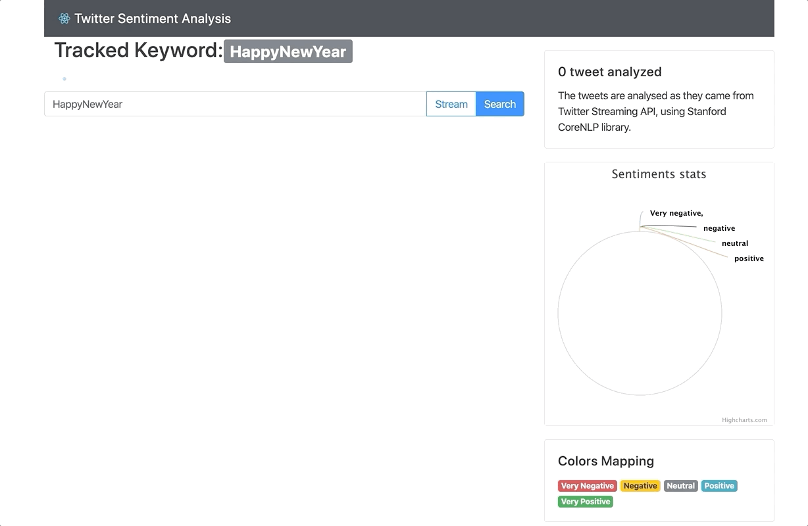

# Darija Sentiment Analyzer

A modern, real-time web application that streams and analyzes the sentiment of tweets using **Spring Boot 3**, **Java 17**, and **Stanford CoreNLP** for the backend, paired with a stunning, premium **React 18** and **Vite** frontend.



## 🌟 Features
- **Real-Time Streaming**: Stream tweets live based on a keyword or hashtag.
- **Historical Search**: Fetch and analyze past tweets matching your keyword.
- **Sentiment Analysis**: Uses Stanford CoreNLP to classify tweets into 5 categories (Very Negative, Negative, Neutral, Positive, Very Positive).
- **Premium UI**: A sleek, dark-mode glassmorphism interface built with React 18 and CSS3.
- **Live Visualizations**: Beautiful, real-time updating Doughnut charts using Highcharts.

## 🛠️ Technology Stack
### Backend
- **Java 17**
- **Spring Boot 3.2.x** (WebFlux & Web)
- **Twitter4J**: For connecting to the Twitter/X API and fetching live streams.
- **Stanford CoreNLP**: For Natural Language Processing and Sentiment Extraction.

### Frontend
- **React 18** (Functional components & Hooks)
- **Vite** (Next-generation frontend tooling)
- **TypeScript**
- **Highcharts / Highcharts React**

---

## 🚀 Getting Started

### Prerequisites
1. **Java 17** installed.
2. **Node.js** (v18+) and **npm** installed.
3. **Twitter Developer API Keys**: You **MUST** have valid Twitter API keys to fetch tweets.

### 1. Configuration (Crucial Step!)
Before running the backend, you must configure your Twitter API keys. 

Open `backend/src/main/resources/application.yaml` and replace the `xxxx` placeholders with your actual Twitter API credentials:

```yaml
twitter:
  consumer-key: YOUR_CONSUMER_KEY
  consumer-secret: YOUR_CONSUMER_SECRET
  access-token: YOUR_ACCESS_TOKEN
  access-token-secret: YOUR_ACCESS_TOKEN_SECRET
```
*(If you skip this step, the app will run, but it will **not** be able to fetch any tweets from Twitter!)*

### 2. Running the Backend
Open a terminal and navigate to the `backend` folder:
```bash
cd backend
./mvnw spring-boot:run
```
*(For Windows, use `.\mvnw.cmd spring-boot:run`)*

### 3. Running the Frontend
Open a **new** terminal and navigate to the `frontend` folder:
```bash
cd frontend
npm install
npm run dev
```

The frontend will start at `http://localhost:5173`. 
Enter a keyword (e.g., "Morocco", "Liverpool") and click **Search Past** or **Live Stream**!
